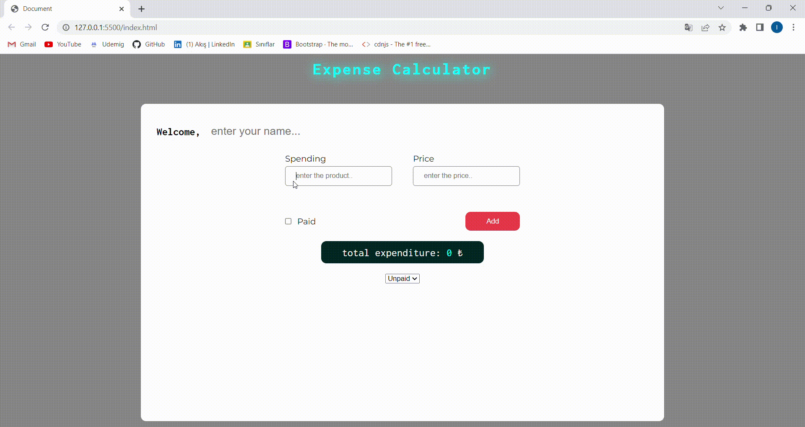

<h1>expenseCalculator</h1>

<h2>Used</h2>

HTML , CSS , JAVASCRİPT

<h2>Features</h2>

We can create a small expense account with javascript, add the preliminary products, select the paid ones, remove the products we do not like or give up from the list, and finally, we can load all the products as a small calculator that we can filter as paid or unpaid.

